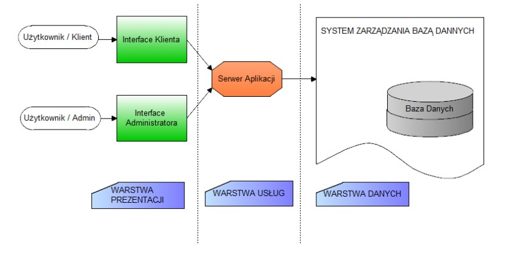
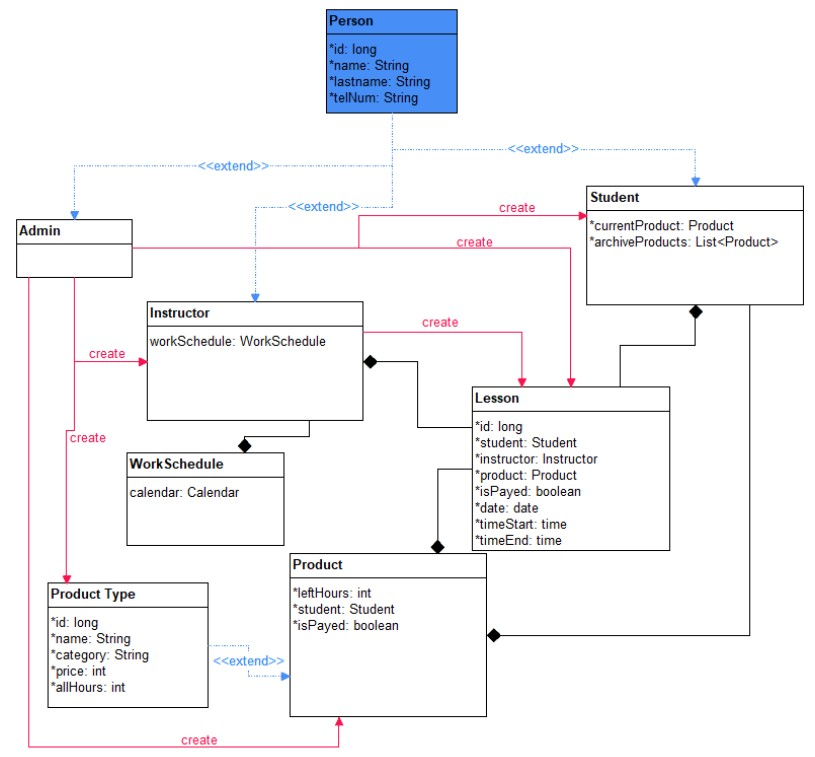

## Story

The aim of the project is to produce an integrated IT system a form of program for handling events in companies such as
driving school. Main design assumptions are based on use case diagrams and a simple form of interface.

### Technologies

* Java
* Springboot
* Postgresql

Scheme of the system functioning

Class diagram

Frontend repo of the app in Angular [here](https://github.com/luqkrzy/driva-client)

